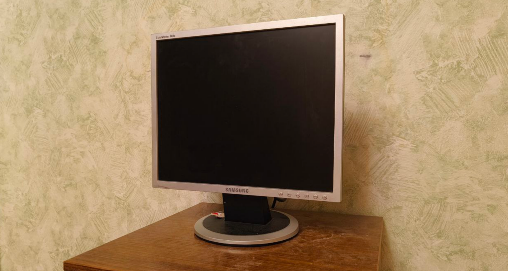
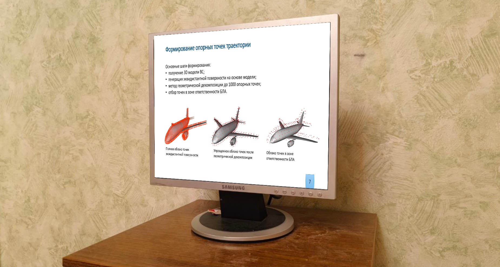

# CV Задание 2: Программная замена экрана (AR)

Репозиторий содержит выполнение домашнего задания по дисциплине "Системы технического зрения". 
Цель проекта — разработать алгоритм для автоматического поиска выключенного экрана (монитора/экрана) на фото и видео с последующим наложением слайда презентации с учетом перспективных искажений.

## 🛠 Стек технологий
- **Python 3**
- **OpenCV** (Canny Edge Detection, Морфологические операции, Homography, WarpPerspective)
- **NumPy**

## 🧠 Описание алгоритма
Для достижения высокой стабильности (особенно на сложных сценах с бликами и плохим контрастом рамки монитора) был реализован следующий пайплайн:
1. Перевод изображения в градации серого и размытие (`GaussianBlur`).
2. Поиск границ с помощью детектора **Canny**.
3. **Морфологическое замыкание** (`cv2.morphologyEx`) — критически важный шаг для объединения микро-разрывов на границах рамки.
4. Поиск всех контуров с флагом `RETR_LIST` для захвата внутренних областей матрицы монитора.
5. Аппроксимация контура до 4 точек и расчет матрицы гомографии (`cv2.findHomography`).
6. В скрипте для видео (`HW_22.py`) добавлено **экспоненциальное сглаживание координат** (EMA), чтобы наложенный слайд не "дрожал" при небольших изменениях освещения, а также защита от перекрытий.

## Результаты работы алгоритма

| Исходное изображение (До) | Результат (После) |
| :---: | :---: |
|  |  |

## 📂 Структура проекта
- `HW_21.py` — Скрипт для обработки статичных изображений.
- `HW_22.py` — Скрипт для обработки видео в реальном времени.
- В папке `/data` лежат исходные материалы, в `/results` — результаты работы.

## 🚀 Как запустить
1. Клонируйте репозиторий:
   ```bash
   git clone https://github.com/Opium507/CV_Homework_2.git

2. Установите зависимости:
    ```bash
    pip install -r requirements.txt
3. Запустите нужный скрипт:
    ```bash
    python HW_22.py

